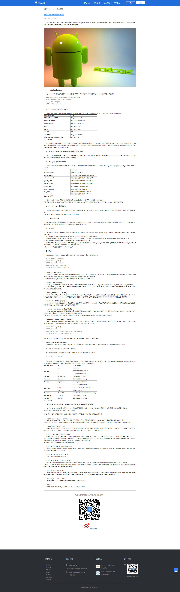

> **在 Android NDK 开发中，有两个重要的文件： `Android.mk` 和 `Application.mk` ，各尽其责，
> 指导编译器如何编译程序，并决定编译结果是什么,  so动态库文件, a静态库文件 和 ELF可执行文件**

- [Application.mk](#Application.mk)
- [Android.mk](#Android.mk)
- [NDK编译选项设置](#NDK编译选项设置)
- [各个平台的c代码判断](#各个平台的c代码判断)


## Application.mk

```shell
# Application.mk实际上是轻量级Makefile，通常在$PROJECT/jni目录下，用于配置所有modules 的编译变量，示例如下:
	
	APP_ABI := armeabi arm64-v8a x86_64 x86 armeabi-v7a
	NDK_TOOLCHAIN_VERSION := clang3.5
	APP_STL := stlport_static
	APP_OPTIM：= debuge			
	
#	APP_ABI（目标平台ABI类型）
#	   	NDK编译中，APP_ABI默认选择armeabi ABI，可通过设置APP_ABI设置一个或者多个ABI。
		
#	NDK_TOOLCHAIN_VERSION（编译器类型、版本）
#		默认采用的是GCC编译器，对于GCC版本的选择与NDK版本有关系，本人使用的是NDK R12，	在64位ABI默认是GCC 4.9，32位ABI默认是GCC 4.8，当然也可以像上面例子中给出的设置一样，设置clang编译器。
	
# APP_STL（运行库类型）
#		Android NDK 默认使用的是最小支持的C++运行库，如果你需要你的NDK程序中使用STL,	则可以设置APP_STL :=  stlport_static，APP_STL有表二中的几种取值。  .c文件没有容器
	
# APP_OPTIM（编译模式）
# 	"release"模式为默认的，生成的是优化后的二进制；也可以设置为"debug"模式，"debug"模式生成的是未优化二进制，提供很多BUG信息，便于调试和分析。
```


## Android.mk

```shell
#Android.mk也是一个轻量级的Makefile，其将C/C++源码组织到一个个module中，module可以是静态库、共享库或者独立的可执行文件， 一个Android.mk文件可以有一个，也可以是多个module，modules之间也可以有依赖关系。

# 1. 基本概念
#    Android.mk中包括NDK提供的宏、变量以及模块描述变量，这些宏、变量以及变量的赋值共同组成了Android.mk文件，其在NDK编译中各尽其责，指导着NDK的编译。
	
# 2. 基础
#    常用基础变量实例示例:
LOCAL_PATH := $(call my-dir)     #宏定义, 表示编译当前目录下的文件, 当前目录名必须为 jni
include $(CLEAR_VARS)            #清除之前操作生成的文件
			
LOCAL_ARM_MODE := arm            #指定编译成 arm(安卓) 平台可运行的可执行文件,下面也必须设置为BUILD_EXECUTABLE
LOCAL_MODULE := hello-jni        #编译出来的文件 中间名是   hello-jni
LOCAL_SRC_FILES := hello-jni.c   #源文件
include $(BUILD_SHARED_LIBRARY)  #指定编译出来的是 动态库.so   静态库.a  还是 LEF.out
   																	# BUILD_SHARED_LIBRARY 是 动态库, 最终文件名 libhello-jni.so 
   													 		 	  # BUILD_STATIC_LIBRARY 是 静态库, 最终文件名 libhello-jni.a
                                    # BUILD_EXECUTABLE		  是 ELF可执行程序, 最终文件名 hello-jni
```


## NDK编译选项设置




## 各个平台的c代码判断

```c
/*
 * Copyright (C) 2009 The Android Open Source Project
 *
 * Licensed under the Apache License, Version 2.0 (the "License");
 * you may not use this file except in compliance with the License.
 * You may obtain a copy of the License at
 *
 *      http://www.apache.org/licenses/LICENSE-2.0
 *
 * Unless required by applicable law or agreed to in writing, software
 * distributed under the License is distributed on an "AS IS" BASIS,
 * WITHOUT WARRANTIES OR CONDITIONS OF ANY KIND, either express or implied.
 * See the License for the specific language governing permissions and
 * limitations under the License.
 *
 */
#include <string.h>
#include <jni.h>

/* This is a trivial JNI example where we use a native method
 * to return a new VM String. See the corresponding Java source
 * file located at:
 *
 *   apps/samples/hello-jni/project/src/com/example/hellojni/HelloJni.java
 */
jstring
Java_com_example_hellojni_HelloJni_stringFromJNI( JNIEnv* env,
                                                  jobject thiz )
{
#if defined(__arm__)
  #if defined(__ARM_ARCH_7A__)
    #if defined(__ARM_NEON__)
      #if defined(__ARM_PCS_VFP)
        #define ABI "armeabi-v7a/NEON (hard-float)"
      #else
        #define ABI "armeabi-v7a/NEON"
      #endif
    #else
      #if defined(__ARM_PCS_VFP)
        #define ABI "armeabi-v7a (hard-float)"
      #else
        #define ABI "armeabi-v7a"
      #endif
    #endif
  #else
   #define ABI "armeabi"
  #endif
#elif defined(__i386__)
   #define ABI "x86"
#elif defined(__x86_64__)
   #define ABI "x86_64"
#elif defined(__mips64)  /* mips64el-* toolchain defines __mips__ too */
   #define ABI "mips64"
#elif defined(__mips__)
   #define ABI "mips"
#elif defined(__aarch64__)
   #define ABI "arm64-v8a"
#else
   #define ABI "unknown"
#endif

    return (*env)->NewStringUTF(env, "Hello from JNI !  Compiled with ABI " ABI ".");
}
```

