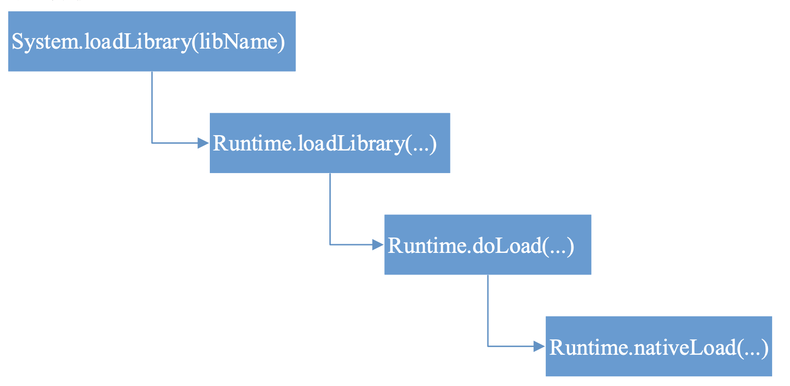
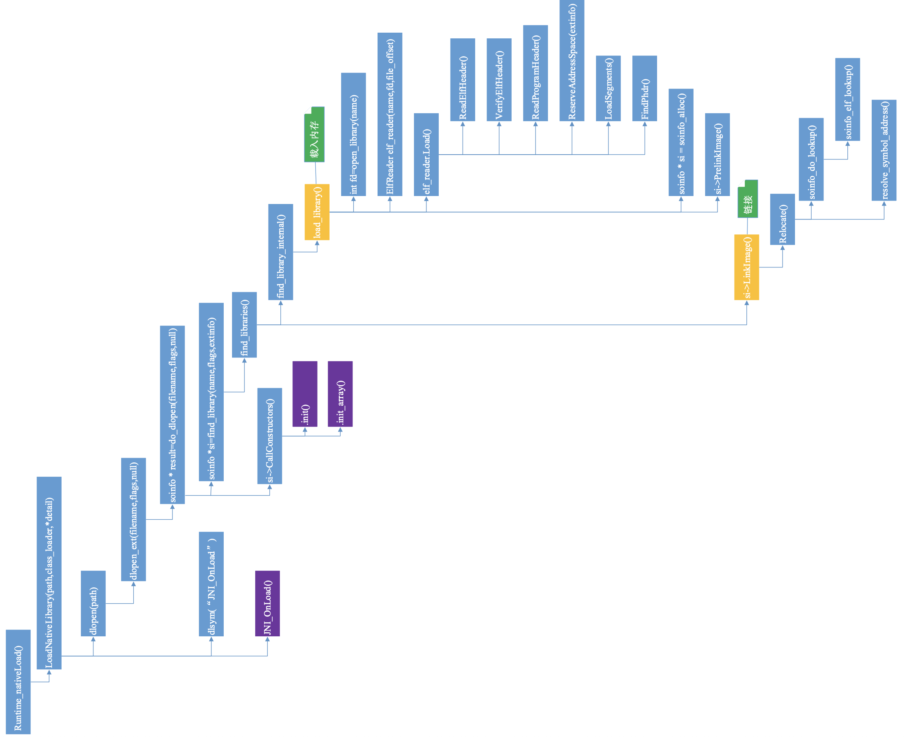

>1. **java层**
>   1. Android 在 java 层加载 so 的接口是 System.loadLibrary()，本文以此为突破口， 逐步向下分析，得到 java 层函数的调用关系
>2. **native层**
>   1. 初始化
>   2. 把so载入内存
>   3. 链接阶段
>3. **关键函数**
>   1. **dlopen() =>  打开so文件**
>      1. 头文件 `<dlfcn.h>`
>         1. 函数原型  **`void* dlopen(const char* path, int mode);`**,  符合 POSIX标准
>   2. **dlsym=>获取函数地址**
>   3. **调用该函数**
>   4. **dlerror->处理错误**
>4. **初始化**
>   1. **`.init`**  在加载 .so之前 进行的初始化操作,  **加载之前进行初始化.**
>   2. **`.init_array `**  加载待要执行的 .so 初始化操作 , **执行 .so 之前进行的初始化**
>5. **常用类**
>   1. Log=>打印log日志信息
>6. **root权限, 读写so都是需要root权限的**
>   1. shell
>   2. 读写内存数据=>内存页属性的修改=>r/w/x=>mprotect()  chmod 777
>      1. mprotect() 通过这个函数可以修改内存页属性
>7. **sublime**
>
>```pascal
>一个.so 文件的加载过程
>	1. 3234-3260 行，判断该.so 文件是否已经加载了，如果已经加载了，检查class_loader 是否一样;
>	2. 3277 行，如果没有加载，调用 dlopen()函数加载该.so 文件;
>	3. 3322 行，调用 dlsym()找到 JNI_OnLoad 函数的地址;
>	4. 3343 行，调用 JNI_OnLoad 函数。
>```
>
>

## java层函数调用关系图




## native 层函数调用关系图

**主要是分析 dlopen()的实现**




